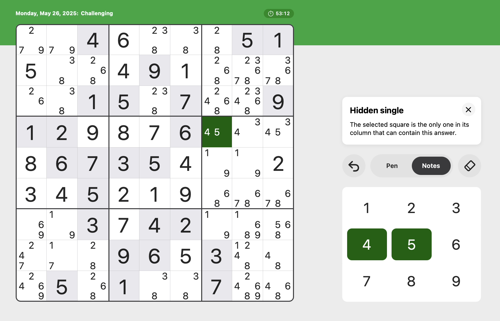
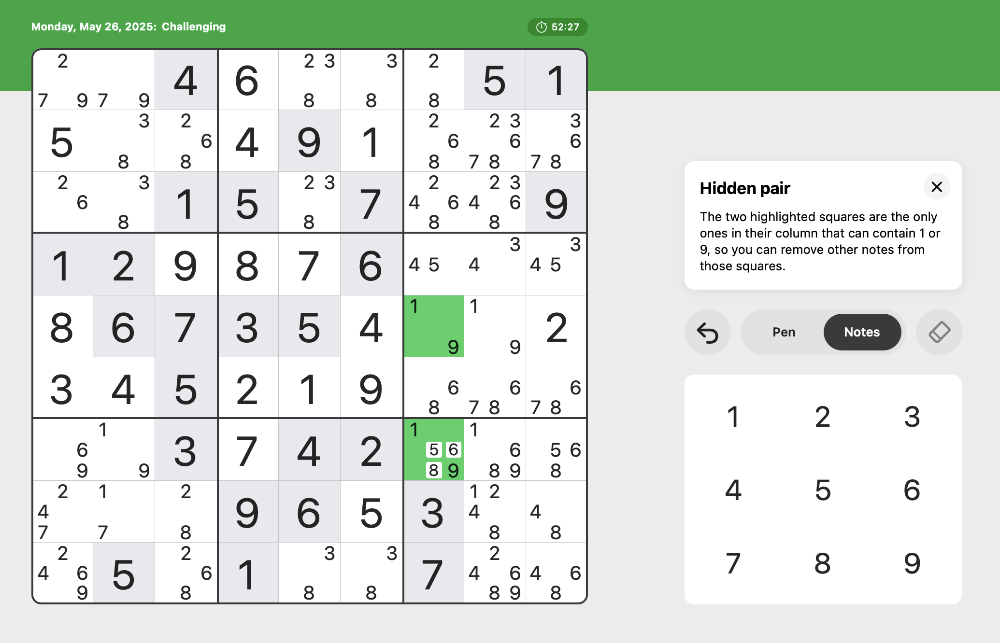
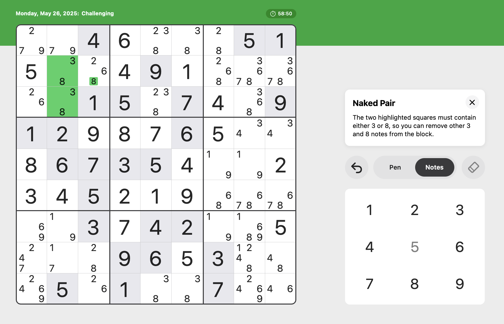
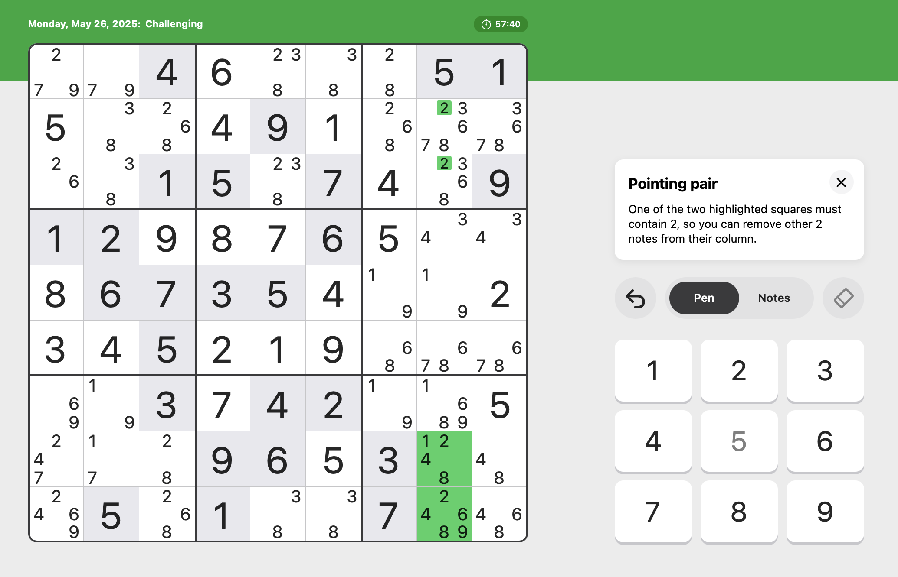

# Sudoku Solver
I wanted to play with code (it's been a while), so I wrote this [Sudoku](https://en.wikipedia.org/wiki/Sudoku) solver in Ruby.

## Algorithm
I recently started playing the Sudoku puzzles that come with my Apple News subscription. In their game's implementation, there's a hint feature that does a nice job of explaining why you should make the decision it's trying to get you to make. So I genericized and then codified those hints into different solvers.

Before any real solving can be done, we run through a `NoteGenerator` that crudely fills in all possible notes for each cell (based purely on row/column/block exclusion). Once that's done, the subsequent steps either use notes to determine values, or use other notes to narrow their own notes (until a value can be determined somewhere). The notes get generated only once, but the subsequent steps are iterated repeatedly until either the puzzle is solved, or no progress is being made. The latter would be indicative of either a poorly-formed puzzle, or a bug in this program.

_Note that "group" refers to either a row, column, or block._

### `HiddenSingle`
A cell has a note that is not present in any other one of its group members' notes, so it should be taken as the value for that cell.


### `HiddenPair`
Two cells within a group are the only ones containing a pair of numbers, so other numbers can be removed from those cells' notes.


### `NakedPair`
Two squares contain exactly 2 identical numbers within a group, so those numbers can be removed from other groupmates' notes.


### `PointingPair`
2 (or more) squares contained in a single row/column within a block have an exclusive note, so all other squares within that row/column (outside that block) should remove the note.


## Usage

### Set up the puzzle to be solved
First, create a text file that represents the unsolved puzzle. It should be a nine-by-nine grid of numbers, with a `.` (or blank) in place of each unknown number:

```text
...5.1...
.....2..1
95.......
1...2.98.
..4.7.1..
8......4.
5....48..
39....5..
...3...27
```

Save this file somewhere conveniently accessed. For our purposes, the file will be called "`/Users/kevin/Desktop/unsolved-puzzle.txt`"

### Run the solver rake task
From your command line, run the `sudoku:solve` rake task with your file name as its sole parameter:

```bash
$ rake "sudoku:solve[/Users/kevin/Desktop/unsolved-puzzle.txt]"
```

The code will run through a series of solution strategies until the puzzle is solved.

### Examine your output
Your solved puzzle will be displayed. Note that when running via a terminal, the initial "seed" values will be bolded.

```
┌───┬───┬───┐
│   │5 1│   │
│   │  2│  1│
│95 │   │   │
├───┼───┼───┤
│1  │ 2 │98 │
│  4│ 7 │1  │
│8  │   │ 4 │
├───┼───┼───┤
│5  │  4│8  │
│39 │   │5  │
│   │3  │ 27│
└───┴───┴───┘

I, [2025-05-29T18:59:39.585238 #58452]  INFO -- : HiddenSingle: exclusive assignment within row for [8,2 (B3,1)] -> 5
I, [2025-05-29T18:59:39.585295 #58452]  INFO -- : HiddenSingle: exclusive assignment within row for [3,3 (B1,1)] -> 1
I, [2025-05-29T18:59:39.585336 #58452]  INFO -- : HiddenSingle: exclusive assignment within row for [4,4 (B2,2)] -> 4
I, [2025-05-29T18:59:39.585420 #58452]  INFO -- : HiddenSingle: exclusive assignment within row for [9,8 (B3,3)] -> 4
I, [2025-05-29T18:59:39.585500 #58452]  INFO -- : HiddenSingle: exclusive assignment within column for [3,6 (B1,2)] -> 9
I, [2025-05-29T18:59:39.585645 #58452]  INFO -- : HiddenSingle: exclusive assignment within block for [3,4 (B1,2)] -> 5
I, [2025-05-29T18:59:39.585697 #58452]  INFO -- : HiddenSingle: exclusive assignment within block for [7,6 (B3,2)] -> 7
I, [2025-05-29T18:59:39.585813 #58452]  INFO -- : HiddenPair: reducing notes within row from [6, 8, 9] for [4,5 (B2,2)] -> [8, 9]
I, [2025-05-29T18:59:39.585822 #58452]  INFO -- : HiddenPair: reducing notes within row from [3, 5, 6, 8, 9] for [6,5 (B2,2)] -> [8, 9]
I, [2025-05-29T18:59:39.585895 #58452]  INFO -- : HiddenPair: reducing notes within row from [1, 5, 6, 8, 9] for [5,9 (B2,3)] -> [5, 9]
I, [2025-05-29T18:59:39.585903 #58452]  INFO -- : HiddenPair: reducing notes within row from [5, 6, 8, 9] for [6,9 (B2,3)] -> [5, 9]
I, [2025-05-29T18:59:39.586104 #58452]  INFO -- : HiddenPair: reducing notes within block from [2, 3, 5, 6] for [9,5 (B3,2)] -> [2, 5]
I, [2025-05-29T18:59:39.586112 #58452]  INFO -- : HiddenPair: reducing notes within block from [2, 3, 5, 6] for [9,6 (B3,2)] -> [2, 5]
I, [2025-05-29T18:59:39.586171 #58452]  INFO -- : HiddenPair: reducing notes within block from [1, 3, 6, 9] for [8,7 (B3,3)] -> [3, 9]
I, [2025-05-29T18:59:39.586180 #58452]  INFO -- : HiddenPair: reducing notes within block from [3, 6, 9] for [9,7 (B3,3)] -> [3, 9]
I, [2025-05-29T18:59:39.586367 #58452]  INFO -- : NakedPair: reducing notes within row from [1, 2, 6, 7, 9] for [4,7 (B2,3)] -> [1, 2, 6, 7]
I, [2025-05-29T18:59:39.586375 #58452]  INFO -- : NakedPair: reducing notes within row from [1, 6, 9] for [5,7 (B2,3)] -> [1, 6]
I, [2025-05-29T18:59:39.586631 #58452]  INFO -- : NakedPair: reducing notes within column from [2, 3, 6, 8, 9] for [9,1 (B3,1)] -> [3, 6, 8, 9]
I, [2025-05-29T18:59:39.586639 #58452]  INFO -- : NakedPair: reducing notes within column from [2, 3, 6, 8] for [9,3 (B3,1)] -> [3, 6, 8]
I, [2025-05-29T18:59:39.586889 #58452]  INFO -- : PointingPair: reducing notes within row from [2, 3, 4, 6] for [7,1 (B3,1)] -> [3, 4, 6]
I, [2025-05-29T18:59:39.586993 #58452]  INFO -- : PointingPair: reducing notes within row from [3, 4, 6, 8, 9] for [5,1 (B2,1)] -> [3, 4, 6, 8]
I, [2025-05-29T18:59:39.587026 #58452]  INFO -- : PointingPair: reducing notes within column from [2, 3, 4, 6, 7, 8] for [2,1 (B1,1)] -> [2, 4, 6, 7, 8]
I, [2025-05-29T18:59:39.587036 #58452]  INFO -- : PointingPair: reducing notes within column from [3, 4, 6, 7, 8] for [2,2 (B1,1)] -> [4, 6, 7, 8]
I, [2025-05-29T18:59:39.587082 #58452]  INFO -- : PointingPair: reducing notes within row from [2, 5] for [9,6 (B3,2)] -> [2]
I, [2025-05-29T18:59:39.587203 #58452]  INFO -- : PointingPair: reducing notes within row from [2, 6, 7, 8] for [3,8 (B1,3)] -> [2, 6, 7]
I, [2025-05-29T18:59:39.587311 #58452]  INFO -- : HiddenSingle: exclusive assignment within row for [7,3 (B3,1)] -> 2
I, [2025-05-29T18:59:39.587346 #58452]  INFO -- : HiddenSingle: exclusive assignment within row for [2,4 (B1,2)] -> 7
I, [2025-05-29T18:59:39.587384 #58452]  INFO -- : HiddenSingle: exclusive assignment within row for [9,5 (B3,2)] -> 5
I, [2025-05-29T18:59:39.587458 #58452]  INFO -- : HiddenSingle: exclusive assignment within row for [2,9 (B1,3)] -> 1
I, [2025-05-29T18:59:39.587576 #58452]  INFO -- : HiddenSingle: exclusive assignment within column for [8,8 (B3,3)] -> 1
I, [2025-05-29T18:59:39.587609 #58452]  INFO -- : HiddenSingle: exclusive assignment within column for [9,6 (B3,2)] -> 2
I, [2025-05-29T18:59:39.587718 #58452]  INFO -- : HiddenSingle: exclusive assignment within block for [1,9 (B1,3)] -> 4
I, [2025-05-29T18:59:39.587736 #58452]  INFO -- : HiddenSingle: exclusive assignment within block for [3,9 (B1,3)] -> 8
I, [2025-05-29T18:59:39.587779 #58452]  INFO -- : HiddenSingle: exclusive assignment within block for [7,9 (B3,3)] -> 6
I, [2025-05-29T18:59:39.587928 #58452]  INFO -- : HiddenPair: reducing notes within column from [2, 4, 6, 8] for [2,1 (B1,1)] -> [4, 8]
I, [2025-05-29T18:59:39.587935 #58452]  INFO -- : HiddenPair: reducing notes within column from [4, 6, 8] for [2,2 (B1,1)] -> [4, 8]
I, [2025-05-29T18:59:39.588551 #58452]  INFO -- : NakedPair: reducing notes within block from [3, 6, 7, 9] for [8,1 (B3,1)] -> [6, 7, 9]
I, [2025-05-29T18:59:39.588561 #58452]  INFO -- : NakedPair: reducing notes within block from [3, 6, 8, 9] for [9,1 (B3,1)] -> [6, 8, 9]
I, [2025-05-29T18:59:39.588569 #58452]  INFO -- : NakedPair: reducing notes within block from [3, 6, 7] for [8,3 (B3,1)] -> [6, 7]
I, [2025-05-29T18:59:39.588576 #58452]  INFO -- : NakedPair: reducing notes within block from [3, 6, 8] for [9,3 (B3,1)] -> [6, 8]
I, [2025-05-29T18:59:39.588926 #58452]  INFO -- : PointingPair: reducing notes within column from [2, 3, 6, 7] for [3,1 (B1,1)] -> [2, 3, 6]
I, [2025-05-29T18:59:39.588936 #58452]  INFO -- : PointingPair: reducing notes within column from [3, 6, 7] for [3,2 (B1,1)] -> [3, 6]
I, [2025-05-29T18:59:39.589080 #58452]  INFO -- : HiddenSingle: exclusive assignment within row for [5,3 (B2,1)] -> 4
I, [2025-05-29T18:59:39.590512 #58452]  INFO -- : HiddenSingle: exclusive assignment within row for [6,3 (B2,1)] -> 3
I, [2025-05-29T18:59:39.590544 #58452]  INFO -- : HiddenSingle: exclusive assignment within row for [9,4 (B3,2)] -> 3
I, [2025-05-29T18:59:39.590576 #58452]  INFO -- : HiddenSingle: exclusive assignment within row for [2,5 (B1,2)] -> 3
I, [2025-05-29T18:59:39.590611 #58452]  INFO -- : HiddenSingle: exclusive assignment within row for [5,6 (B2,2)] -> 3
I, [2025-05-29T18:59:39.590645 #58452]  INFO -- : HiddenSingle: exclusive assignment within row for [8,7 (B3,3)] -> 3
I, [2025-05-29T18:59:39.590709 #58452]  INFO -- : HiddenSingle: exclusive assignment within column for [2,7 (B1,3)] -> 2
I, [2025-05-29T18:59:39.590741 #58452]  INFO -- : HiddenSingle: exclusive assignment within column for [3,1 (B1,1)] -> 2
I, [2025-05-29T18:59:39.590779 #58452]  INFO -- : HiddenSingle: exclusive assignment within column for [4,8 (B2,3)] -> 2
I, [2025-05-29T18:59:39.590815 #58452]  INFO -- : HiddenSingle: exclusive assignment within column for [5,7 (B2,3)] -> 1
I, [2025-05-29T18:59:39.590833 #58452]  INFO -- : HiddenSingle: exclusive assignment within column for [5,9 (B2,3)] -> 5
I, [2025-05-29T18:59:39.590868 #58452]  INFO -- : HiddenSingle: exclusive assignment within column for [6,6 (B2,2)] -> 5
I, [2025-05-29T18:59:39.590887 #58452]  INFO -- : HiddenSingle: exclusive assignment within column for [6,8 (B2,3)] -> 7
I, [2025-05-29T18:59:39.590932 #58452]  INFO -- : HiddenSingle: exclusive assignment within column for [8,1 (B3,1)] -> 9
I, [2025-05-29T18:59:39.590966 #58452]  INFO -- : HiddenSingle: exclusive assignment within column for [9,7 (B3,3)] -> 9
I, [2025-05-29T18:59:39.591000 #58452]  INFO -- : HiddenSingle: exclusive assignment within block for [3,2 (B1,1)] -> 3
I, [2025-05-29T18:59:39.591043 #58452]  INFO -- : HiddenSingle: exclusive assignment within block for [7,1 (B3,1)] -> 3
I, [2025-05-29T18:59:39.591060 #58452]  INFO -- : HiddenSingle: exclusive assignment within block for [8,3 (B3,1)] -> 7
I, [2025-05-29T18:59:39.591090 #58452]  INFO -- : HiddenSingle: exclusive assignment within block for [1,5 (B1,2)] -> 2
I, [2025-05-29T18:59:39.591125 #58452]  INFO -- : HiddenSingle: exclusive assignment within block for [4,6 (B2,2)] -> 1
I, [2025-05-29T18:59:39.591594 #58452]  INFO -- : HiddenSingle: exclusive assignment within block for [8,5 (B3,2)] -> 6
I, [2025-05-29T18:59:39.591626 #58452]  INFO -- : HiddenSingle: exclusive assignment within block for [3,7 (B1,3)] -> 7
I, [2025-05-29T18:59:39.591658 #58452]  INFO -- : HiddenSingle: exclusive assignment within block for [5,8 (B2,3)] -> 8
I, [2025-05-29T18:59:39.591676 #58452]  INFO -- : HiddenSingle: exclusive assignment within block for [6,9 (B2,3)] -> 9
I, [2025-05-29T18:59:39.592299 #58452]  INFO -- : PointingPair: reducing notes within column from [8, 9] for [4,5 (B2,2)] -> [9]
I, [2025-05-29T18:59:39.592429 #58452]  INFO -- : HiddenSingle: exclusive assignment within row for [2,1 (B1,1)] -> 4
I, [2025-05-29T18:59:39.592447 #58452]  INFO -- : HiddenSingle: exclusive assignment within row for [1,1 (B1,1)] -> 7
I, [2025-05-29T18:59:39.592479 #58452]  INFO -- : HiddenSingle: exclusive assignment within row for [7,2 (B3,1)] -> 4
I, [2025-05-29T18:59:39.592499 #58452]  INFO -- : HiddenSingle: exclusive assignment within row for [4,2 (B2,1)] -> 7
I, [2025-05-29T18:59:39.592540 #58452]  INFO -- : HiddenSingle: exclusive assignment within row for [6,4 (B2,2)] -> 6
I, [2025-05-29T18:59:39.592566 #58452]  INFO -- : HiddenSingle: exclusive assignment within row for [6,5 (B2,2)] -> 8
I, [2025-05-29T18:59:39.592583 #58452]  INFO -- : HiddenSingle: exclusive assignment within row for [4,5 (B2,2)] -> 9
I, [2025-05-29T18:59:39.592611 #58452]  INFO -- : HiddenSingle: exclusive assignment within row for [2,6 (B1,2)] -> 6
I, [2025-05-29T18:59:39.592640 #58452]  INFO -- : HiddenSingle: exclusive assignment within row for [4,7 (B2,3)] -> 6
I, [2025-05-29T18:59:39.592667 #58452]  INFO -- : HiddenSingle: exclusive assignment within row for [3,8 (B1,3)] -> 6
I, [2025-05-29T18:59:39.592705 #58452]  INFO -- : HiddenSingle: exclusive assignment within column for [1,2 (B1,1)] -> 6
I, [2025-05-29T18:59:39.592733 #58452]  INFO -- : HiddenSingle: exclusive assignment within column for [2,2 (B1,1)] -> 8
I, [2025-05-29T18:59:39.592768 #58452]  INFO -- : HiddenSingle: exclusive assignment within column for [4,3 (B2,1)] -> 8
I, [2025-05-29T18:59:39.592796 #58452]  INFO -- : HiddenSingle: exclusive assignment within column for [5,1 (B2,1)] -> 6
I, [2025-05-29T18:59:39.592817 #58452]  INFO -- : HiddenSingle: exclusive assignment within column for [5,2 (B2,1)] -> 9
I, [2025-05-29T18:59:39.592870 #58452]  INFO -- : HiddenSingle: exclusive assignment within column for [9,3 (B3,1)] -> 6
I, [2025-05-29T18:59:39.592888 #58452]  INFO -- : HiddenSingle: exclusive assignment within column for [9,1 (B3,1)] -> 8

┌───┬───┬───┐
│742│561│398│
│683│792│451│
│951│843│276│
├───┼───┼───┤
│175│426│983│
│234│978│165│
│869│135│742│
├───┼───┼───┤
│527│614│839│
│396│287│514│
│418│359│627│
└───┴───┴───┘
Solver spent 0.009829s
```